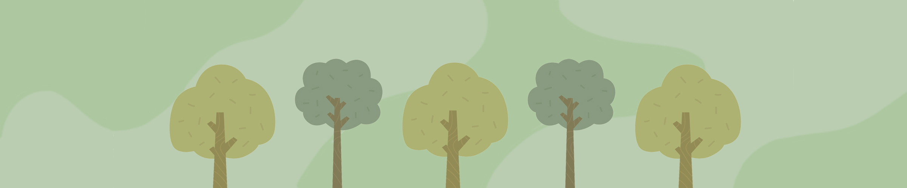

<!-- TABLE OF CONTENTS -->

  
Table of Contents

  <ol>
    <li><a href="#ThRees">About The Project</a></li>
    <li><a href="#Installation">Installation </a></li>
    <li><a href="#Usage">Usage</a></li>
    <li><a href="#Technologies">Technologies</a></li>
    <li><a href="#Process">Process</a></li>
    <li><a href="#Challenges">Challenges & Wins</a>
    <li><a href="#Contribution">Contribution</a></li>
    <li><a href="#Licence">Licence</a></li>
  </ol>

<!-- ABOUT THE PROJECT -->
# ThRees - Client

With ThRees you can track which days your recycling, compost and general waste is collected in your local postcode. 
It also builds a sense of community as when you’ve got some spare time, and some spare rubbish, you can learn from other users to make new things and reuse to save the planet. You can also make posts to encourage others and share your knowledge too! 

<!-- Installation & usage -->
# Installation

If you would like to see the code for yourself or run the client locally start by cloning the repository through the command line: (`git clone git@github.com:mithurssan/ThRees_client.git`).

Otherwise view the website [here](https://threes-client.onrender.com/).

# Usage

To run the client you have two options:
 1. run live-server **or**
 2. directly open html file

# Technologies

The technologies used to build the client:
* 
* 
* 
* 
* 

# Process

Wireframes were made on Figma and pages were implemented via HTML, CSS and Bootstrap.

# Challenges & Wins

### Challenges

* Allowing users to post images and then viewing those images on the page for everyone to see.
* Only allowing logged in users to create posts.
* Only allowing logged in users to add or update their waste information.

### Wins

* We completed a functional MVP.
* We came up with a solution to our challenges and got them working.

# Contribution

* Mithurssan Santhirakumar (<https://github.com/mithurssan>)

* Gi Ho (<https://github.com/ThegeralbeanQD>)

* Azeem Falade (<https://github.com/ABF22>)

# Licence

* [MIT Licence](https://opensource.org/license/mit/)
